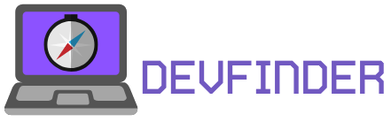
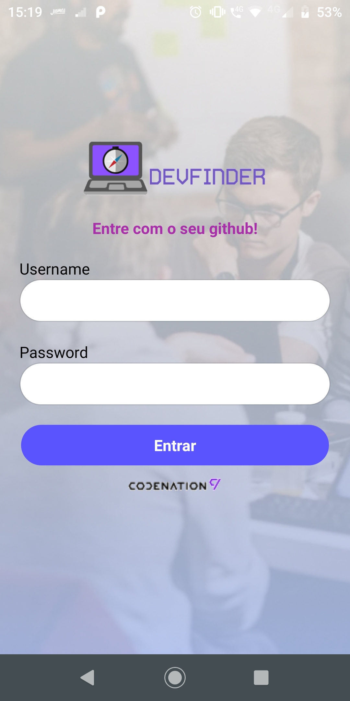
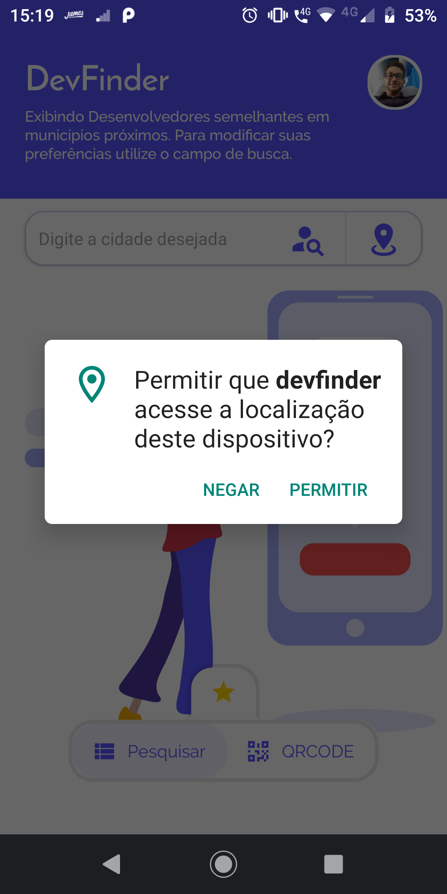
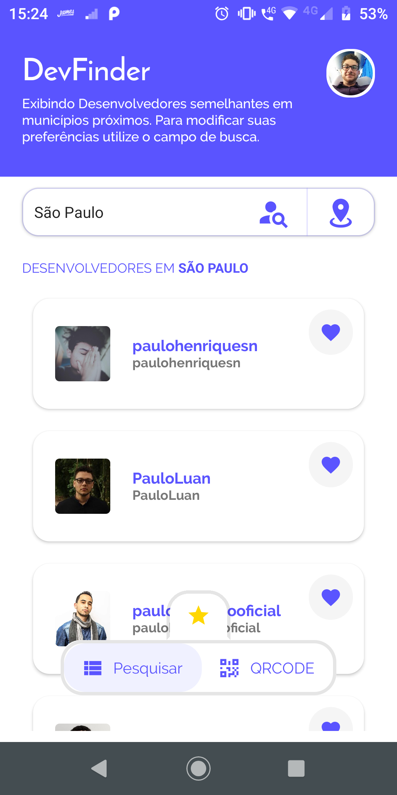
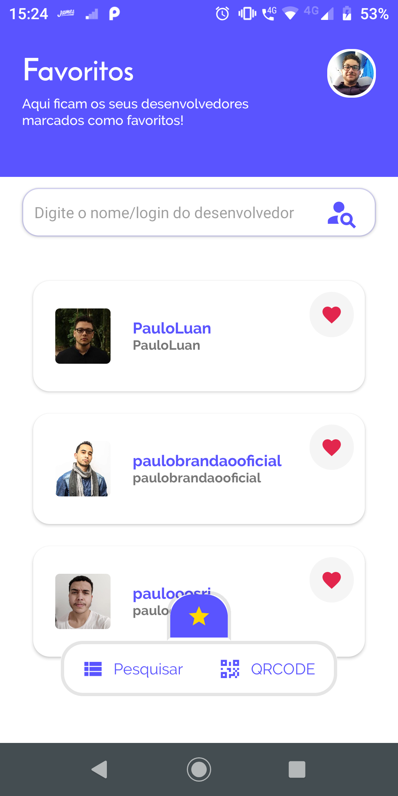
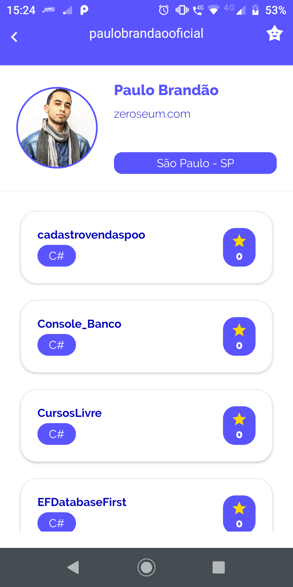

# Codenation Dev Finder
<h1 align="center">
 
</h1>

<h3 align="center">
 Encontre devs em sua cidade e compartilhe seu perfil no github!
</h3>

# :computer: Layout








<hr />

## :question: Sobre o projeto

<p>
Este é o Projeto desenvolvido durante a aceleração de React Native da Codenation em parceria com a empresa SAS
</p>

<p>
  O Objetivo deste app é encontrar desenvolvedore em sua cidade e facilitar o compatilhamento de seu perfil no github com outros desenvolvedores a fim de agilizar a divulgação de seus projetos por meio de uma plataforma simples e intuitiva.
</p>

# :computer: Tecnologias

<p>
  Este projeto foi desenvolvido inteiramente com react-native consumindo as apis do <a href="https://api.github.com/">github</a> e geolocalização da <a href="https://nominatim.openstreetmap.org/">openstreetmaps </a>
</p>

## :books: Guia de instalação e execução

### Pré-requisitos
 - Node
 - NPM ou YARN
 - React Native
 - Emulador ou device fisico
 - GIT

### Como executar
<p>
  Clone o projeto e rode
</p>

```yarn ou npm install```

<p>
  Com as dependencias do projeto devidademente baixadas e com seu emulador ou device configurados, você pode executar

  ### android

  ```yarn android ou npm run android```

  ### ios

  ```yarn ios ou npm run ios```

  isto fará com que o aplicativo seja instalado em seu dispositivo e irá habilitar o metro bundler.
</p>

<hr />

## :rocket: Equipe de desenvolvimento
- <a href="https://github.com/davinyvidal">Daviny Vidal. </a>
- <a href="https://github.com/fbueno12">Felipe Bueno. </a>
- <a href="https://github.com/Dev4ster">Victor Menezes. </a>


